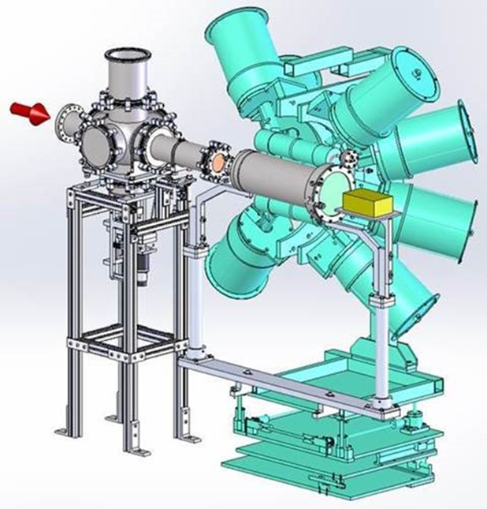
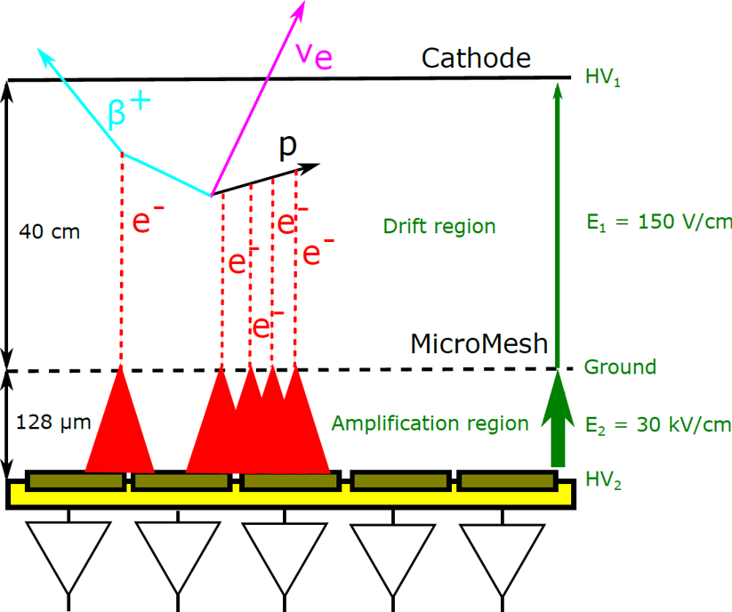
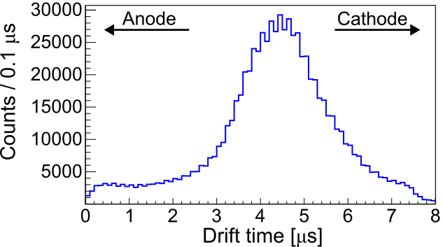
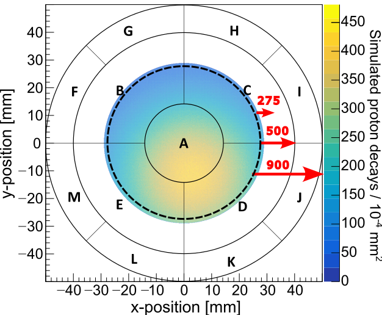

# Simplified Geometric Monte Carlo (SGMC) simulation

This is a simulation of β-delayed charged-particle decays in the Proton Detector, part of the Gaseous Detector with Germanium Tagging (GADGET) system developed at Michigan State University. This simplified, geometric Monte Carlo simulation (SGMC) was designed to characterize the proton-detection efficiency of GADGET by recreating the initial beam distribution from data and simulating proton track ionization within the active region of the detector chamber. The project consists of three programs that run sequentially:

1. **`RecoverBeamSpot`** uses the multiplicity of counts across the five active detector pads to determine a fit a 2D Gaussian distribution representative of the beam spot projected onto the Proton Detector's segmented electronics readout.
2. **`GetParticleDistributions`** uses the position and width parameters deduced from χ<sup>2</sup> minimization fit from the first method to save these beam-spot distributions to histograms, which will be read out later in the full simulation. It also uses drift time data from a source ROOT file as a proxy for the longitudinal beam distribution in order to simulate the effect of electron diffusion within the gaseous medium, assuming a uniform eletric field. 
3. **`SGMC`** calculates the energy deposition of protons in the fill gas using stopping power calculations in SRIM to determine the number of ionization electrons produced in each decay. It assumes β decays decays are isometric and uses the geometry of the emitted protons to estimate how likely a proton is to be detected.

## Physics overview

<sup>31</sup>Cl is rare isotope of chlorine with a radioactive half-life of T<sub>1/2</sub> = 190 ms. It undergoes β<sup>+</sup> decay to <sup>31</sup>S, often populating one of its many excited states. It is possible for <sup>31</sup>S levels with excitation energies above the proton separation energy (S<sub>p</sub> = 6131 keV) to decay via proton emission, producing <sup>30</sup>P as the final daughter nucleus. Precise measurement of these β-delayed proton decays provides informations on the properties of <sup>31</sup>S exicted states, which are useful for comparing to nuclear shell-model theory as well as reducing nuclear uncertainties associated with astrophysical modeling. The original motivation for this experiment was to constraint the <sup>30</sup>P(p,γ)<sup>31</sup>S reaction rate, which is important for understanding nucleosynthesis in classical novae.

### GADGET
A measurement was performed with GADGET, which pairs the Proton Detector, a gaseous proportional counter, with the Segmented Germanium Array (SeGA) for γ-ray detection. The <sup>31</sup>Cl beam was produced by the Coupled Cyclotron Facility at the National Superconducting Cyclotron Laboratory (now the Facility for Rare Isotope Beams). The radioactive ion beam entered the experimental setup through a thin Kapton window and was implanted in gaseous detector's active volume, composed of a P10 fill gas (90% Ar, 10% CH<sub>4</sub>).



*Figure 1: Schematic drawing of the GADGET system. The cylindrical, gaseous Proton Detector is surrounded by SeGA's 16 high-purity germanium detector crystals, which are kept cool using an automated cryogenic system of liquid nitrogen dewars. The red arrow indicates the direction of the incoming radioactive beam.*

### Principle of Operation
The ions diffuse for a short time under Brownian motion before undergoing  β<sup>+</sup> decay. The detector is mostly transparent to fast-moving β particles, but the more massive protons and recoiling <sup>30</sup>P nucleus deposit their full center-of-mass energy into ionizing the fill gas. These ionization electronics drift at a constant velocity under the influence of a uniform electric field until they reach the amplification region, where their signals are amplified by the Micro-Mesh Gaseous Structure (MICROMEGAS). The detector's anode plane is segmented into 13 charge-senstive pads consisting of a central circular pad, which is surrounded by four annular pads. These five inner pads define the active region of the Proton Detector and are surrounded by eight veto pads, which are used to exclude decay events that do not deposit their full energy within the active region.



*Figure 2: Cartoon drawing the the Proton Detector's principle of operation.*

### Beam Distributions 

SeGA is used to measure the γ-rays emitted from exicited states of <sup>31</sup>S populated by <sup>31</sup>Cl decay and allows for detailed proton-γ coincidence analysis for various radiations collected within the same time window. This is necessary in order to construct an accurate nuclear decay scheme for <sup>31</sup>Cl(βpγ)<sup>30</sup>P. The γ-ray information is also useful for reconstructing a rough approximation of the longitudinal distribution of the implanted ions. Because the relationship between the initial position of the decay event and the time it takes for ionization electronics to reach the MICROMEGAS is linear, measuring the time between coincident γ-rays and proton events allows us estimate the <sup>31</sup>Cl distribution along the length of the Proton Detector.



*Figure 3: Drift times for β-delayed particles detected in coincidence with γ-ray events observed in SeGA.*



*Figure 4: Reconstructed beam spot projected onto the segmented MICROMEGAS pad plane.*

For more details on the design, testing, and commission of the GADGET apparatus, see Friedman *et al.*, Nucl. Instrum. Methods A **940**, 93 (2019).

### Systematic Uncertainties
Thus, the variable uncertainties associated with modeling GADGET's proton detection efficiencies are as follows:

- **Initial beam spot** - the transverse beam distribution projected onto the MICROMEGAS readout plane. This is modeled as a 2D Gaussian profile, whose position and width are fit from the measured pad intensities (see `recoverBeamSpot.cpp`), and is subject to outward diffusion under Brownian motion over the lifetime of the radioactive ion.
- **Electron diffusion** - the radial diffusion of electrons within the fill gas as the ionized particles drift from the initial position of the decay event towards the MICROMEGAS, which blurs the apparent track and can push ionization charge outside the active region.
- **Stopping power**  - the energy loss (dE/dx curve) of protons in the fill gas, which determines how many ionization electrons are produced along the track.
- **Veto threshold** - the total number of eletrons required to trigger the veto condition on one or more the eight outer pads, which exclude decays that deposit too much charge outside the active volume.

This code evaluates the efficiency across a grid of variations in each of these inputs so that the systematic uncertainty on the extracted branching ratios can be read off directly from the spread in results.

## Repository layout

```
.
├── Makefile
├── README.md
├── .gitignore
├── gecoverBeamSpot.cpp           # stage-0: fit beam-spot x_0, y_0, R
├── getParticleDistributions.cpp  # stage-1: sample input distributions
├── sgmc.cpp                      # stage-2: Monte-Carlo efficiency scan
├── recoverBeamSpot.cfg           # stage-0 config
├── getParticleDistributions.cfg  # stage-1 config
├── sgmc.cfg                      # stage-2 config
├── data/                         # read-only inputs
│   ├── BetaDecayData31Cl.root    # reference beam-profile histogram
│   ├── padCounts.txt             # (optional) measured pad intensities
│   ├── protonStoppingPower808TorrP10gas.txt
│   ├── stoppingPower96percent.txt
│   └── stoppingPower104percent.txt
├── results/                      # generated outputs (gitignored)
│   ├── ParticleDistributions.root
│   └── efficiencySummary.txt
└── images/                       # README figures (gitignored)
    ├── GADGET.png                
    ├── PrincipleOfOperation.png  
    ├── hDriftTimes.png           
    └── hBeamSpot.png             
```

## Requirements

- **ROOT 6.24 or newer.** Earlier versions lack the `TF2::GetRandom2(x, y, TRandom*)` and `TH2::GetRandom2(x, y, TRandom*)` overloads that the parallel sampling relies on. Check with `root-config --version`.
- **A C++14 compiler** (`g++` 5.0+ or `clang++` 3.4+).
- **GNU make**. On macOS, the default `make` works; on BSD you may need `gmake`.
- **pthreads** (standard on Linux/macOS; the Makefile passes `-pthread`).

## Building

From the project root:

```bash
make                           # builds all three executables
make RecoverBeamSpot           # stage-0 only
make GetParticleDistributions  # stage-1 only
make SGMC                      # stage-2 only
make clean                     # removes binaries
```

Make sure ROOT's environment is set up first — if `root-config --libs` prints nothing, source ROOT's setup script:

```bash
source /path/to/root/bin/thisroot.sh
```

## Running

The three stages run sequentially: stage 0 extracts beam-spot parameters from data, stage 1 generates the input histograms, stage 2 runs the Monte Carlo simulation.

```bash
./RecoverBeamSpot          recoverBeamSpot.cfg
./GetParticleDistributions getParticleDistributions.cfg
./SGMC                     sgmc.cfg
```

If no config path is passed, each program falls back to its default filename (`recoverBeamSpot.cfg`, `getParticleDistributions.cfg`, and `sgmc.cfg` respectively).

### Stage 0: `RecoverBeamSpot`

Fits a 2D Gaussian beam spot to the Proton Detector events measured on the five active pads. The code integrates the assumed beam profile over each pad and uses MINUIT (SIMPLEX → MIGRAD) to minimize the χ<sup>2</sup> between
calculated and measured pad-intensity ratios.

Outputs the best-fit `(x_0, y_0, R)` to stdout. Set `drawBeam = 1` in the config to pop a TCanvas showing the fitted beam spot overlaid on the pad geometry.

The extracted values feed into stage 1's `x_0`, `y_0`, and `R` parameters (along with any ±1σ variations you want to sweep for systematic uncertainty).

### Stage 1: `GetParticleDistributions`

Reads `data/tripleCoincidences.root`, samples the longitudinal drift-time distribution, builds N Gaussian beam-spot histograms, and builds M × 9 electron-cloud histograms (one per De value per drift time from 0 to 8 µs). Writes everything to
`results/ParticleDistributions.root`.

Output histograms:

- `DriftTimes` — 1D reconstruction of the drift-time reference distribution
- `BeamSpot_k` for k = 0..N-1 — 2D beam spot for preset k (`numHalfLives`, `x_0`, `y_0`, `R` in the config are length-N parallel lists)
- `EC_De{k}_t{j}us` for k = 0..M-1, j = 0..8 — electron cloud family for De[k] at drift time j µs (j = 0 is internally treated as 0.1 µs to avoid a degenerate σ = 0)

### Stage 2: `SGMC`

Reads `results/ParticleDistributions.root` and runs the Monte Carlo simulation for `nProtons`. For each energy in `labEnergies`, for each combination of `(beamSpotHist, stoppingFile, De-family)`, the code tracks protons through the active volume and counts how many pass the veto-threshold cut. The resulting efficiencies define the scan used to extract the central value and systematic band.

Output: `results/efficiencySummary.txt` — human-readable table with one block per energy, listing every variant's efficiency plus the median/min/max across variants.

## Configuration

All three programs use the same simple format: `key = value` per line, `#` starts a comment, blank lines are ignored. List-valued keys use comma-separated values in stage 1 and whitespace-separated values in stages 0 and 2 (historical accident; kept for backwards compatibility with existing config files).

Required and optional keys for each stage are documented at the top of the respective `.cpp` file, with defaults given in parentheses.

### Typical workflow

1. Edit `RecoverBeamSpot.cfg` to use your experiment's pad intensities (either set `padsExperimental` inline or point `intensityFile` at a text file with five numbers).
2. Run `./RecoverBeamSpot` and record the fitted `(x_0, y_0, R)`.
3. Edit `GetParticleDistributions.cfg` to use those values as the central preset in the `x_0`, `y_0`, `R` lists, and add ±1σ shifts as additional presets for systematic uncertainty.
4. Run `./GetParticleDistributions` to produce `ParticleDistributions.root`.
5. Edit `simulations.config` to use the list of beam-spot histograms and De values from the previous step, plus your stopping-power files, energies, and thresholds.
6. Run `./SGMC` to produce the efficiency summary.

### Tuning for your workload

The two knobs that matter most for runtime:

- **`nProtons` / `nElectrons`** (stage 1) and **`nProtons`** (stage 2) control per-histogram and per-variant statistics. Scale these together with the number of (stoppingFile × beamSpot × De × energy) variants to budget total CPU time.
- **`nThreads`** (stages 1 and 2) sets the worker-pool size. `0` auto-detects the core count. Stage 1 parallelizes over histogram-filling jobs (beam-spot jobs are ~100× more expensive than electron-cloud jobs, so speedup caps at ~N when you have N beam spots). Stage 2 parallelizes over proton energies (so speedup caps at the number of energies).

Stage 0 is not parallelized — it takes a few seconds at most, and MINUIT has no natural axis to parallelize over.

## Parallelization notes

Stages 1 and 2 use a `std::thread` pool with atomic job-index dispatch. ROOT's thread-safety caveats required several specific workarounds:

- **`TF2` formulas are pre-compiled on the main thread** and copy-constructed into each worker, because formula construction invokes the Cling JIT which has process-global state.
- **ROOT class dictionaries are warmed on the main thread** before workers are launched, so no worker triggers a lazy Cling dictionary load.
- **Input histograms are cloned serially on the main thread** into per-thread workspaces. `TH1::Clone` walks ROOT's global directory lists and is not thread-safe.
- **Each worker owns its own `TRandom3`** and all `GetRandom*` calls route through it explicitly, so `gRandom` is never touched.
- **Output file writes are serialized** on the main thread after all workers have joined. `TFile` is not thread-safe.

If you port to a newer ROOT that enables `ROOT::EnableThreadSafety()` cleanly, some of the above can be simplified.

## Reproducibility

Each simulation job is seeded deterministically from `std::time(nullptr) + constant * jobIndex`, so re-running with the same clock time produces bit-identical output regardless of how jobs migrate between threads. Different invocations differ because `std::time` changes; hardcode a fixed seed in `seedBase` if you need cross-run reproducibility.

## References

For the GADGET detector system:

> M. Friedman, D. Pérez-Loureiro, T. Budner, E. Pollacco, C. Wrede, *et al.*, *GADGET: a Gaseous Detector with Germanium Tagging*, Nucl. Instrum. Methods A **940**, 93 (2019). [doi:10.1016/j.nima.2019.05.100](https://doi.org/10.1016/j.nima.2019.05.100)

For the GADGET II upgrade (a TPC-based successor to the present Proton Detector):

> R. Mahajan, T. Wheeler, E. Pollacco, C. Wrede, *et al.*, *Time projection chamber for GADGET II*, Phys. Rev. C **110**, 035807 (2024). [doi:10.1103/PhysRevC.110.035807](https://doi.org/10.1103/PhysRevC.110.035807)

## Citation

If you use this code in published work, please cite:
> T. Budner, *<sup>31</sup>Cl β-Delayed Proton Decay and Classical Nova Nucleosynthesis*, Ph.D. thesis, Michigan State University (2022).

> T. Budner, M. Friedman, L. J. Sun, C. Wrede, *et al.* *β-Delayed Proton Pandemonium: A first look at the <sup>31</sup>Cl(βpγ)<sup>30</sup>P decay scheme* (2026), in preparation.
